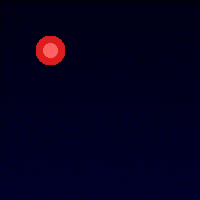
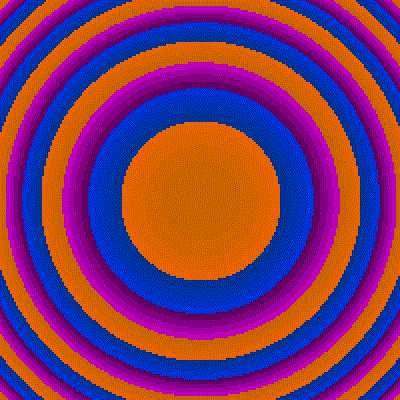
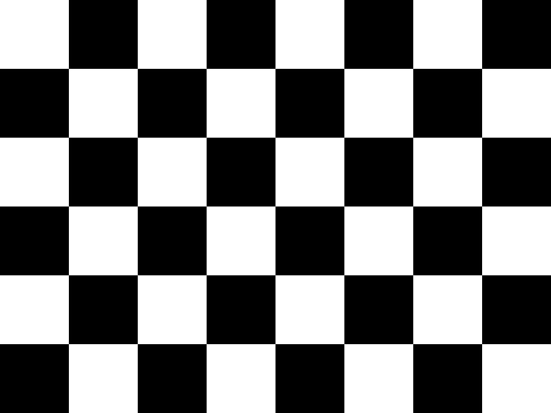
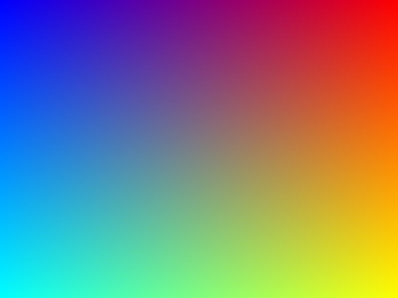
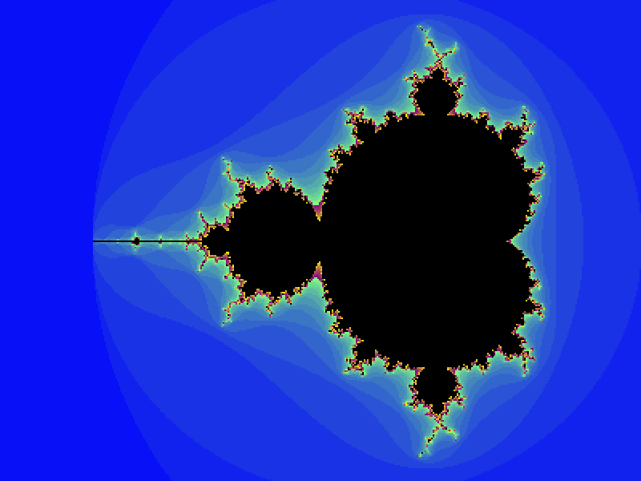
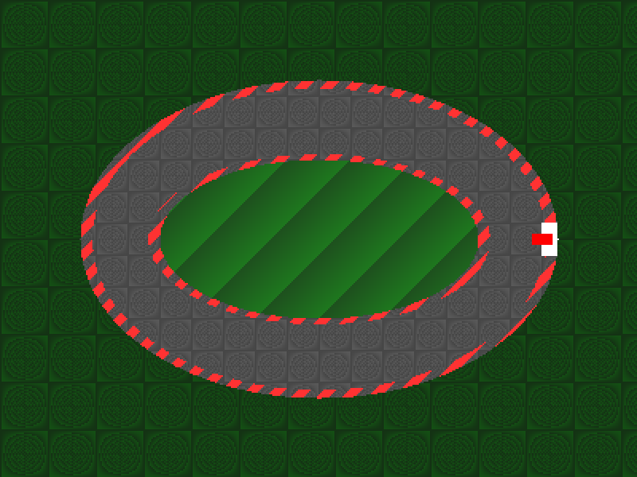

# F1-Lang-Compiler

**A Formula 1-themed programming language that compiles to native executables via LLVM.**

<p align="center">
  
  
</p>

F1-Lang is a complete compiler implementation featuring lexer, parser, type checker, IR generation, optimizer passes, and LLVM code generation. It produces standalone native executables with no runtime dependencies.

## Quick Start

```bash
# Build the compiler
make build

# Run a program
./build/f1c run examples/fibonacci.f1

# Compile to native executable
./build/f1c build examples/fibonacci.f1 -o fib
./fib
```

## The Language

F1-Lang uses Formula 1 racing terminology for keywords:

| F1-Lang | Equivalent | Description |
|---------|------------|-------------|
| `driver` | `var` | Variable declaration |
| `pitstop` | `func` | Function declaration |
| `drs` | `if` | Conditional (DRS = Drag Reduction System) |
| `defend` | `else` | Else clause |
| `lap` | `for` | Loop |
| `finish` | `return` | Return statement |
| `greenlight` | `true` | Boolean true |
| `redlight` | `false` | Boolean false |
| `radio` | `print` | Output to console |

### Hello World

```javascript
radio("Lights out and away we go!");
```

### Fibonacci

```javascript
pitstop fib(driver n) {
    drs (n < 2) {
        finish n;
    }
    finish fib(n - 1) + fib(n - 2);
}

radio(fib(20));  // 6765
```

### FizzBuzz

```javascript
lap (driver i = 1; i <= 100; i = i + 1) {
    drs (i % 15 == 0) {
        radio("FizzBuzz");
    } defend drs (i % 3 == 0) {
        radio("Fizz");
    } defend drs (i % 5 == 0) {
        radio("Buzz");
    } defend {
        radio(i);
    }
}
```

### Tail-Call Optimized Recursion

```javascript
// Computes fib(50) instantly with no stack overflow
pitstop fib(driver n, driver a, driver b) {
    drs (n == 0) {
        finish a;
    }
    finish fib(n - 1, b, a + b);  // tail call optimized
}

radio(fib(50, 0, 1));  // 12586269025
```

## Graphics

F1-Lang includes built-in graphics primitives for creating images and animations:

```javascript
canvas(400, 300);                    // Create 400x300 canvas
pixel(x, y, r, g, b);               // Set pixel color (0-255)
render("output.ppm");               // Save as PPM image
framedir("outputs/");               // Set animation output directory
snapshot(frameNumber);              // Save animation frame
```

### Gallery

| Checkered Flag | Racing Stripes | Color Gradient |
|:--------------:|:--------------:|:--------------:|
|  |  |  |

| Mandelbrot Set | Race Track |
|:--------------:|:----------:|
|  |  |

### Bouncing Ball Animation

```javascript
framedir("outputs/");
canvas(200, 200);

driver bx = 50;  // ball position
driver by = 50;
driver vx = 4;   // velocity
driver vy = 3;
driver radius = 15;

lap (driver frame = 0; frame < 100; frame = frame + 1) {
    // Draw each pixel
    lap (driver py = 0; py < 200; py = py + 1) {
        lap (driver px = 0; px < 200; px = px + 1) {
            driver dx = px - bx;
            driver dy = py - by;
            drs (dx*dx + dy*dy < radius*radius) {
                pixel(px, py, 255, 30, 30);  // Red ball
            } defend {
                pixel(px, py, 0, 0, 20 + py/10);  // Blue gradient bg
            }
        }
    }
    snapshot(frame);

    // Update physics
    bx = bx + vx;
    by = by + vy;
    drs (bx <= radius || bx >= 200 - radius) { vx = 0 - vx; }
    drs (by <= radius || by >= 200 - radius) { vy = 0 - vy; }
}
```

## Architecture

```
┌─────────────┐    ┌─────────────┐    ┌─────────────┐    ┌─────────────┐
│   Source    │───▶│    Lexer    │───▶│   Parser    │───▶│     AST     │
│   (.f1)     │    │             │    │   (Pratt)   │    │             │
└─────────────┘    └─────────────┘    └─────────────┘    └──────┬──────┘
                                                                │
┌─────────────┐    ┌─────────────┐    ┌─────────────┐    ┌──────▼──────┐
│   Native    │◀───│    LLVM     │◀───│   F1-IR     │◀───│    Type     │
│   Binary    │    │   Codegen   │    │  Optimizer  │    │   Checker   │
└─────────────┘    └─────────────┘    └─────────────┘    └─────────────┘
```

### Compiler Phases

| Phase | Description |
|-------|-------------|
| **Lexer** | Tokenizes source into keywords, operators, literals, identifiers |
| **Parser** | Pratt parser builds AST with correct operator precedence |
| **Type Checker** | Hindley-Milner style inference, scope validation, type errors |
| **IR Generator** | Converts typed AST to F1-IR (SSA form) |
| **Optimizer** | Constant folding, propagation, dead code elimination, TCO |
| **Codegen** | Emits LLVM IR, compiles to native via `clang` |

### Optimizer Passes

- **Constant Folding** — `3 + 4` → `7` at compile time
- **Constant Propagation** — Track constant values through variables
- **Dead Code Elimination** — Remove unreachable/unused code
- **Tail Call Optimization** — Self-recursive tail calls use `musttail`

## CLI Commands

```bash
./build/f1c run <file>              # Compile and execute
./build/f1c build <file> -o <out>   # Compile to native binary
./build/f1c emit <file>             # Show generated LLVM IR
./build/f1c lex <file>              # Show tokens
./build/f1c parse <file>            # Show AST
./build/f1c check <file>            # Type check only
```

## Building from Source

**Requirements:**
- Go 1.21+
- LLVM/Clang (for native compilation)
- ffmpeg (optional, for converting animations to GIF)

```bash
git clone https://github.com/nikhi3632/f1-lang-compiler.git
cd f1-lang-compiler
make build
make test
```

## Project Structure

```
f1-lang-compiler/
├── cmd/f1c/        # CLI entry point
├── lexer/          # Tokenizer
├── ast/            # AST node definitions
├── parser/         # Pratt parser
├── types/          # Type representations
├── typechecker/    # Type inference & checking
├── ir/             # F1-IR definitions (SSA form)
├── irgen/          # AST → F1-IR
├── optimizer/      # Optimization passes
├── codegen/        # F1-IR → LLVM IR
├── runtime/        # C runtime (graphics support)
├── compiler/       # Pipeline orchestration
├── examples/       # Example programs
└── spec/           # Language specification
```

## Type System

- **Primitives:** `int` (64-bit signed), `bool`, `string`, `void`
- **Functions:** First-class, with closure support
- **Inference:** Types inferred from usage; explicit annotations not required

```javascript
driver x = 42;                    // inferred: int
driver flag = greenlight;         // inferred: bool
driver greet = pitstop(driver n) { finish n * 2; };  // inferred: (int) -> int
```

## License

MIT

---

*"Lights out and away we go!"*
